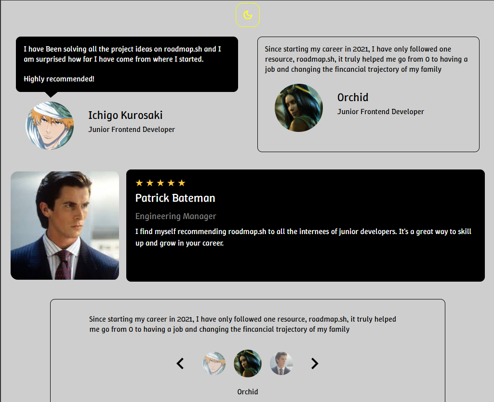

  <h1 align="center">
    Testimonial Cards
  </h1>

 

# Objective
Create several testimonial cards and show different layouts and positions for each one of them using CSS.
  

# README
https://roadmap.sh/projects/testimonial-cards
 
 

# PREVIEW

# EXTRA FEATURES
Add support for dark mode using CSS variables and javascript (same implementation as past projects).
 
Add a real interation to the carousel using javascript.
 
 

# Auxiliary Resources
<ol>
  <li>
    <a href="https://origin-blog.mediatemple.net/design-creative/carousels-dont-have-to-be-complicated/" alt="Carousels Don't Have to be Complicated">Carousels Don't Have to be Complicated</a>
     
    An article talking about many advanced features of CSS, used to get a better understanding of ":before" pseudo classes.
  </li>
   
  <li>
    <a href="https://www.w3schools.com/cssref/sel_before.php" alt="W3Schools - CSS ::before Pseudo-element">CSS ::before Pseudo-element</a>
     
    W3Schools reference for ":before" pseudo-element.
  </li>
   
  <li>
    <a href="https://css-tricks.com/css-only-carousel/" alt="CSS-Only Carousel">CSS-Only Carousel</a>
     
    Some simple carousel layouts for CSS and extra articles about different implementations.
  </li>
   
</ol>
